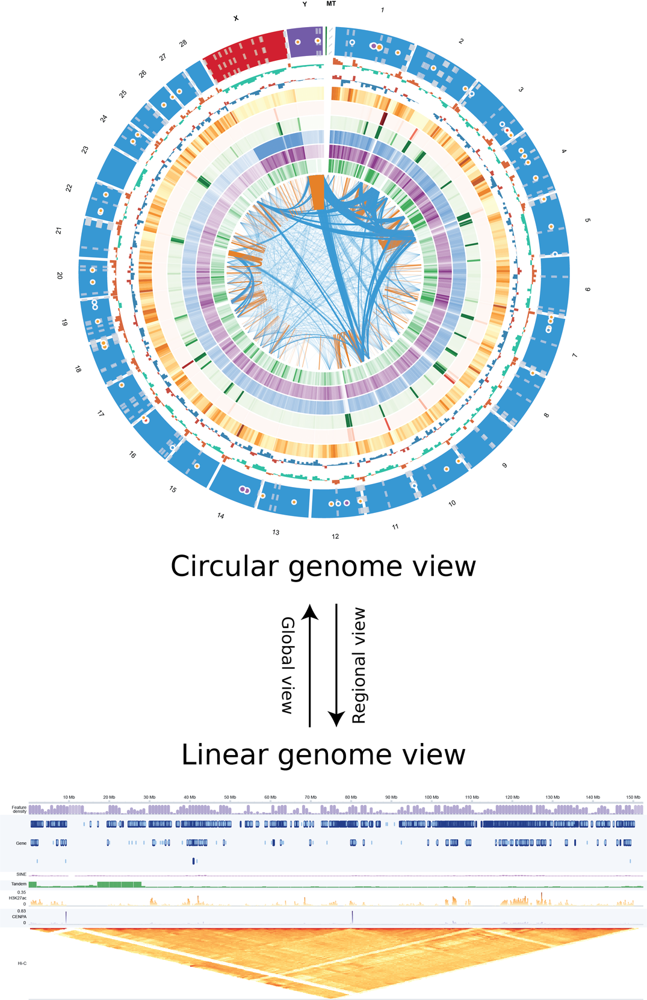

# genome-building-pipeline

Code for a de novo genome-building pipeline — assembly & scaffolding, repeat
masking, and genome annotation — for the degu (*Octodon degus*).

## Genome browser

Many of the genome-assembly results are presented interactively in the **degu
genome browser** — the final assembly, CENPA / H3K27ac BigWig signal tracks, the
Hi-C contact matrix, and segdup / HOR / structural-error annotation tracks:

**https://renlab.sdsc.edu/share/jhc103/degu-genome-browser/**

  

## Repository layout

- `01-genome-assembly/` — assembly (hifiasm), Hi-C preprocessing, scaffolding (HapHiC), mitochondrial filtering, sex-chromosome identification
- `02-genome-assembly-initial-evaluation/` — initial assembly QC (Merqury, BUSCO, coverage, GenomeScope, Hi-C contact maps)
- `03-genome-annotation/` — repeat masking, transfer- and de novo-based annotation
- `04-genome-annotation-initial-evaluation/` — annotation evaluation (read-depth tracks, pie/density plots, GO enrichment, evolutionary placement, synteny)
- `05-genome-assembly-indepth-assessment-contam-filtering/` — in-depth assembly assessment (contamination filtering, purging, polishing, paralog screens, structural-error detection)
- `06-tandem-repeat-analysis/` — tandem-repeat analysis (TRF, centroAnno, CENP-A)
- `07-segmental-duplication-analysis/` — segmental-duplication analysis (BISER)
- `08-pyCirclize-plots/` — pyCirclize circos plots (genomic / tandem-repeat / segdup features)
- `100-inputs-sequencing-reads/` — input data pointers (reads, assemblies, references, annotations)
- `100-outputs-genome-information/` — generated genome information (BUSCO, Merqury, centroAnno, segdup, TRF, …)
- `200-degu-genome-browser/` — static D3 degu genome browser (frontend + embedded segdup data)

## Configuration

Edit `config.sh` (repository root) to set paths, conda environments, and cluster
settings for your environment. Every pipeline script finds and sources it
automatically, so you do not need to edit the scripts themselves.

## Notes

- Scripts are Slurm batch scripts written for the TSCC cluster at UCSD; adjust
  the `#SBATCH` scheduler lines for your own cluster.
- Folder names use hyphens (`-`), file names use underscores (`_`).
